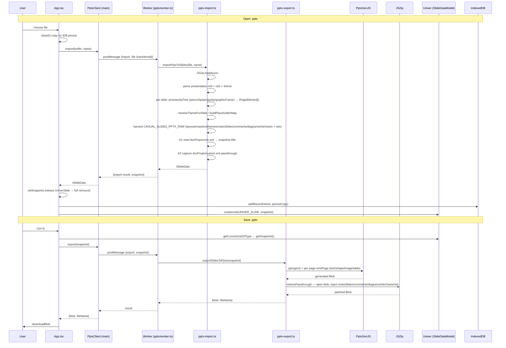
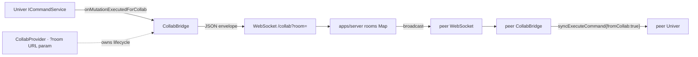

# Knowledge graph

Module-level map of Casual Slides — who imports whom, who owns what, where the seams are. Last refreshed 2026-05-27 (post wave 10 + renderer pipeline patches). Re-run when the source tree shifts.

For prose narrative see [`ARCHITECTURE.md`](./ARCHITECTURE.md); for I/O internals see [`PPTX_PIPELINE.md`](./PPTX_PIPELINE.md); for Univer gaps see [`UNIVER_SLIDES_GAPS.md`](./UNIVER_SLIDES_GAPS.md). This file is the **topology**, not the prose.

---

## 1. System graph

```mermaid
graph TD
  subgraph Browser
    main[main.tsx — React root]
    App[App.tsx — state + global shortcuts]
    UV[UniverSlide.tsx — Univer mount + rev probe]
    Shell[shell/* — Title · Toolbar · Status · Notes · Theme · Background · Properties · Recent · About · LayoutPicker · SlideShow · SlideContextMenu]
    Layouts[shell/layouts.ts — 6 slide-layout templates for the new-slide picker]
    Cmds[univer/commands.ts — dispatchSlideCommand]
    PptxClient[pptx/client.ts — worker proxy]
    PptxWorker[pptx/worker.ts]
    PptxImport[pptx/pptx-import.ts — ~3000 LOC · 70 helpers]
    PptxExport[pptx/pptx-export.ts — incl. restorePassthrough JSZip injection]
    CollabHook[collab/CollabProvider.tsx — useCollabBridge]
    CollabBridge[collab/bridge.ts — CollabBridge]
    Recent[storage/recent-files.ts — IndexedDB]
    Default[default-slide.ts]
  end

  subgraph Univer["@univerjs/* v0.24.0 (4 pnpm patches)"]
    SlideModel[SlideDataModel · ISlideData + resources]
    CmdSvc[ICommandService — onMutationExecutedForCollab]
    Render[engine-render — Image · RichText · Path · Group · Scene]
    Adaptors[slides views/render/adaptor.ts — Shape · RichText · Image · Table · Chart adaptors]
    DocsEngine[docs/docs-ui — IDocumentData renderer (nested in text frames)]
  end

  subgraph Vendor
    JSZip[jszip]
    XML[fast-xml-parser]
    PptxGen[pptxgenjs]
  end

  subgraph Server["apps/server (Node)"]
    Relay[index.ts — ws relay · rooms Map · /health]
  end

  main --> App
  App --> UV
  App --> Shell
  App --> PptxClient
  App --> CollabHook
  App --> Recent
  App --> Cmds
  Shell --> Cmds
  Shell --> Layouts
  UV --> Univer
  Adaptors --> Render
  Adaptors --> DocsEngine
  Cmds --> CmdSvc
  CollabHook --> CollabBridge
  CollabBridge --> CmdSvc
  CollabBridge -. WebSocket .-> Relay
  PptxClient --> PptxWorker
  PptxWorker --> PptxImport
  PptxWorker --> PptxExport
  PptxImport --> JSZip
  PptxImport --> XML
  PptxExport --> PptxGen
  PptxExport --> JSZip
  App --> Default
  Recent --> App
```

---

## 2. PPTX I/O pipeline



### Pipeline node inventory (importer — 70 helpers)

Key surfaces in `apps/web/src/pptx/pptx-import.ts`:

| Helper | Role |
|---|---|
| `processSpTree` | Per-slide walker — dispatches `<p:sp>` / `<p:cxnSp>` / `<p:pic>` / `<p:grpSp>` / `<p:graphicFrame>` |
| `processGraphicFrame` | Gap 3 dispatch — TABLE (`<a:tbl>`) and CHART (`<c:chart>`) variants |
| `parseTable` + `parseTableCellAppearance` | G1-G4 — full `ITable` with rows/cells/spans/fills/borders |
| `parseChart` (wave 9d) | H2/H3 — chart type + series + categories from `ppt/charts/chartN.xml` |
| `parseCustGeom` (wave 9f) | D6 — `<a:custGeom>` path commands → SVG-style `pathData` |
| `processPicNode` | IMAGE element extraction; cropProperties (E3), alpha (E4), color adjust (E5), effectLst (E6) |
| `extractRichDoc` | Builds `IDocumentData` with multi-run + paragraph styles + custom ranges (hyperlinks) |
| `parseRunProps` | Per-run style: fs/bl/it/ul/st/ol/va/spc/tol/cl/bg + ff fallback chain |
| `parseShapeAppearance` | Fill / outline / dash / cap / arrowheads / effectLst |
| `parseEffectList` + `parseShadow` | D18/D19 — outerShdw / innerShdw / glow / reflection / blur |
| `parseArrowhead` | D17 — `<a:headEnd>` / `<a:tailEnd>` |
| `readColor` + `applyColorModifiers` | srgb / scheme / prst / sys + lumMod/lumOff/tint/shade cascade |
| `readGradStops` / `readGradFirstStop` | A3 / D9 — full gradient stop harvest with first-stop fallback |
| `resolveThemeForSlide` | Walks slide → layout → master → theme; cached by master path |
| `buildPlaceholderMap` | I3 / I4 — placeholder geometry + default text style inheritance |
| `extractSlideBackground` + `extractSlideBackgroundImage` | A2 (solid) + A4 (picture-as-backdrop) |
| `resolveBgRefIdx` (wave 9b) | A5-idx — `<p:bgRef idx>` → bgFillStyleLst lookup |
| `extractSlideHidden` | A6 — `<p:sld show="0">` → `slideProperties.isSkipped` |
| `synthesizeServicePlaceholders` (wave 8f) | I5 — footer / date / sldNum synth from master/layout |
| `extractDeckTitle` + `extractCustomProps` | K1 / K2 — docProps/core.xml + docProps/custom.xml |
| `extractDefaultTextStyle` (wave 8e) | K3 — `<p:defaultTextStyle>` deck-level defaults |

Exporter (`pptx-export.ts`): `emitTextElement`, `emitShapeElement` (with `isTransparentFill`), `emitImageElement`, `emitTableElement`, then `restorePassthrough` opens the generated blob via JSZip and injects captured raw parts at their original zip paths.

Coordinate-system seams crossed: pptx OOXML = EMU (`/9525` on import) ↔ pptx export = inches (`/96`) ↔ Univer = px @ 96 DPI ↔ docs-engine = px internally for layout.

---

## 3. Rendering pipeline (data → pixels)

```mermaid
graph LR
  SD[ISlideData snapshot] --> SDM[SlideDataModel unit]
  SDM --> SRC[slide.render-controller]
  SRC --> CV[canvas-view.ts]
  CV --> OP[ObjectProvider · adaptor.ts]
  OP --> SA[ShapeAdaptor — Path/Rect + dashStyle + cap + effectLst.outerShdw + glow]
  OP --> RA[RichTextAdaptor — prefers richText.rich over flat text]
  OP --> IA[ImageAdaptor — srcRect crop + brightness/contrast + shadow/glow + transparency]
  OP --> TA[TableAdaptor — per-cell Rect + RichText overlay inside Group]
  OP --> CA[ChartAdaptor — placeholder rect (no chart engine yet)]
  RA --> DocE[docs-engine — IDocumentData renderer]
  SA --> ER[engine-render Path / Rect / Group]
  IA --> ER_Img[engine-render Image — shadow + filter pipeline]
  TA --> ER
  CA --> ER
  ER --> Scene[Scene · z-order + hit-test]
  ER_Img --> Scene
  Scene --> Canvas[(HTML canvas)]
```

### Renderer-side patch surface

Wave 8 + 9 + 10 + fix commits added significant work to the patched bundles. Read the readable `.ts` sources in `../univer-revamp/`, not the patch `.js` artifacts.

| Concern | Source | Commit |
|---|---|---|
| RichText prefers `richText.rich` over flat `text` | slides-ui RichTextAdaptor | `497b70c` |
| Shape rect fallback for unknown prstGeom | slides-ui ShapeAdaptor | `767841e` |
| Per-prstGeom `Path` (line/triangle/diamond/parallelogram/trapezoid/pentagon/hexagon/octagon/arrows/chevron/plus/star) | slides-ui ShapeAdaptor | `c744e17` |
| `outline.dashStyle` → canvas `strokeDashArray` | slides-ui ShapeAdaptor | `fd0f90d` |
| `outline.cap` → canvas `strokeLineCap` | slides-ui ShapeAdaptor | `ff2c217` |
| `effectLst.outerShdw` → canvas shadow props | slides-ui ShapeAdaptor | `e279b47` |
| `effectLst.glow` → canvas shadow channel (zero offset + larger blur + 0.6 opacity) | slides-ui ShapeAdaptor | `3165db6` |
| `cropProperties` → engine-render `Image.srcRect` | slides-ui ImageAdaptor | `d1d3d3a` |
| Image shadow + CSS-filter pipe | engine-render Image.render() | `c58d728` |
| `IImageProperties.effectLst` slot | core | `b48748a` |
| ImageAdaptor honours effectLst / brightness / contrast / transparency | slides-ui ImageAdaptor | `a9b6a83` |
| TableAdaptor + ChartAdaptor registered | slides-ui | `bf510ec` |
| TableAdaptor per-cell Rect + RichText overlay | slides-ui TableAdaptor | `c43610c` |
| Placeholder (type, idx) tolerant matching | slides-ui controllers | `5040dbc` |
| RichText respects authored frame height + bodyPr insets | slides-ui RichTextAdaptor | `b1924f0`, `0be74f6` |
| Text-overflow — docs-engine paginating per wrap-line | docs / engine-render | `1b3c143` |
| Z-stacking from source-XML DOM order | slides-ui canvas-view + import | `58fca1b` |

### Known-fragile surfaces (per user feedback this turn)

- **Z-axis**: model `zIndex` flows through adaptor mount order; recent commit forces DOM-order stacking but interaction with intra-Group order (TableAdaptor Group, group-shape flattening F1/F2) and the synthetic `s${pageOrdinal}-bg` element at z=0 has not been audited end-to-end. See companion analysis (this PR's renderer-pipeline report).
- **Text size calculation**: `richText.fs` (pt) → docs-engine px conversion + C13 autofit's `fs` multiplication at import + bodyPr insets shrinking content box. Possible double-shrink and pagination edge cases noted by `1b3c143`.

---

## 4. Collab graph



Echo-loop guard: `options.fromCollab || options.onlyLocal` (`apps/web/src/collab/bridge.ts:88`). Yjs upgrade replaces only the wire format; bridge hook stays.

---

## 5. Univer fork-patch graph

| Patch | LOC | Touches | Notes |
|---|---|---|---|
| `patches/@univerjs__core@0.24.0.patch` | 147 | IStyleBase.{spc, tol, bg-via-7l}, ITextOutline, IOutline.{cap, headEnd, tailEnd}, IArrowhead, IShapeProperties.effectLst + IShadow/IGlow/IReflection/IBlur/IEffectList, IImageProperties.effectLst | All non-breaking optional widenings |
| `patches/@univerjs__slides@0.24.0.patch` | 1458 | SlideDataModel rev tracking, ISlideData.resources, PageElementType.{TABLE, CHART, VIDEO} + ITable/IChart/IVideo + IPageElement union, multiple renderer adaptors (RichText / Shape / Image / Table / Chart), canvas-view DOM-order z-stacking | Carries Gap 1, 2 (V1), 3, plus the slides-side renderer work |
| `patches/@univerjs__slides-ui@0.24.0.patch` | 1233 | Element-mutations V1 (`slide.command.add-text` → `slide.mutation.insert-element`) | Gap 2 V1; fork's `slide/element-mutations` branch has V2/V3 not yet mirrored |
| `patches/@univerjs__engine-render@0.24.0.patch` | 232 | Image.render() shadow + filter pipeline; misc null-guards, docs-engine page-break fix | Powers the image-effect adaptors |

Fork lives at `../univer-revamp/` on `slide/element-mutations` — branch is ahead of fork's `dev` by 14+ slide-related commits. The `pnpm patch` artifacts in `patches/` are the production-side mirror.

---

## 6. UI shell node table

| Component | File | Concern |
|---|---|---|
| `TitleBar` | `shell/TitleBar.tsx` | File name edit, Open/Save buttons, About + Properties + Recent triggers, collab pill |
| `Toolbar` | `shell/Toolbar.tsx` | Ribbon-style actions; bridges to `window.__casualSlides_*` globals |
| `StatusBar` | `shell/StatusBar.tsx` | Slide count, notes toggle |
| `NotesPanel` | `shell/NotesPanel.tsx` | Speaker-notes editor |
| `ThemePicker` | `shell/ThemePicker.tsx` | Color scheme catalog |
| `BackgroundPicker` | `shell/BackgroundPicker.tsx` | 16-chip palette + custom + "apply to all" |
| `PropertiesDialog` | `shell/PropertiesDialog.tsx` | File → Properties modal |
| `RecentFilesDialog` | `shell/RecentFilesDialog.tsx` | Lists IDB rows; reopens via `importBuffer` |
| `AboutDialog` | `shell/AboutDialog.tsx` | Help → About — version, repo, license |
| `LayoutPicker` | `shell/LayoutPicker.tsx` | New-slide picker; dispatches `slide.mutation.insert-page` with a pre-formed `ISlidePage` |
| `layouts` | `shell/layouts.ts` | 6 layout templates (title-only, title+content, two-column, blank, etc.) at 960×540 |
| `SlideShow` | `shell/SlideShow.tsx` | F5 fullscreen present mode |
| `SlideContextMenu` | `shell/SlideContextMenu.tsx` | Slide-bar right-click: New / Duplicate / Delete |
| `icons` | `shell/icons.tsx` | Shared SVG icons |

Cross-component wiring: `App.tsx` owns dialog state and exposes `window.__casualSlides_openSlideshow / toggleNotes / openThemes / openAbout / openLayoutPicker` so the Toolbar can fire without prop-drilling through App's tree.

---

## 7. Test graph

| Spec | Config | Purpose |
|---|---|---|
| `tests/e2e/smoke.spec.ts` (~2700 LOC) | `playwright.config.ts` | Single-tab smoke + wave-by-wave round-trip asserts (now covers waves 1 → 9f + 10) |
| `tests/e2e/collab-multitab.spec.ts` | `playwright.collab.config.ts` | Two-tab mutation mirror |
| `tests/e2e/prod-smoke.spec.ts` | `playwright.prod.config.ts` | Built-bundle smoke |
| `tests/e2e/__diagnostic__/*` | `playwright.diagnostic.config.ts` | Manual screenshot / probe harnesses |

---

## 8. Key cross-file invariants

- **`window.univer` singleton** — set by `UniverSlide.tsx` mount; consumed by `App.tsx`, `univer/commands.ts`, `collab/CollabProvider.tsx`. Don't introduce a second instance.
- **Remount-on-import** — `App.tsx` keys `<UniverSlide>` on `snapshot.id`. `disposeUnit + createUnit` does not re-attach the canvas (verified via `tests/e2e/__diagnostic__/open-pptx.spec.ts`).
- **Echo-loop guard** — `bridge.ts:88` only. New collab paths must re-check `fromCollab`.
- **ArrayBuffer ownership** — `pptx/client.ts` transfers the buffer to the worker (detaches it); `App.tsx:importBuffer` slices a copy before calling `import()` so IDB persist gets durable bytes.
- **`set-thumb` and `activate` stay `OPERATION`** — Gap 2 explicitly excludes them.
- **`s${pageOrdinal}-bg` lives at z=0** — synthetic IMAGE backdrop from A4 picture backgrounds; other extractors start `ZCounter` at 1 so the backdrop is always beneath authored content.
- **Passthrough convention** — anything captured into `ISlideData.resources[].data` under name `CASUAL_SLIDES_PPTX_RAW` must be a JSON-stringified object keyed by zip path. `restorePassthrough` only injects categories PptxGenJS doesn't generate (notesSlides / comments / diagrams / ink / charts + their rels) — layouts / masters / themes are deliberately NOT restored to avoid breaking PptxGenJS-generated rels.

---

## 9. Phase ↔ fidelity status

| Phase | Touched modules | Status |
|---|---|---|
| P0 spike A (Univer bootstrap) | `UniverSlide.tsx` · `default-slide.ts` | ✅ |
| P0 spike B (pptx round-trip) | `pptx/*` + 4 patches | ✅ — **92 / 99 ✅, 0 ⚠️, 7 ❌ deferred** (waves 1 → 10) |
| P0 spike C (collab patch) | `patches/*` · `collab/bridge.ts` · `apps/server/` | 🔄 — rev-tracking ✅; Gap 2 V1 ✅; V2/V3 on fork only, not yet patched |
| P1 (single-user editor) | `shell/*` · `univer/commands.ts` · `storage/recent-files.ts` · `LayoutPicker` · `AboutDialog` | ✅ |
| P2 (Yjs upgrade) | `apps/server/` · `collab/bridge.ts` | ⏳ |
| P3 (presence) | `collab/PresenceLayer.tsx` etc. | ⏳ |
| P4 (breadth — animations + master/layout UI) | Univer fork + `shell/*` | 🔄 — Gap 3 (tables / charts / video) model ✅, renderer ⚠️ chart engine stub |
| P5 (presenter mode) | `shell/SlideShow.tsx` etc. | 🔄 — basic F5 works; speaker view TODO |
| P6 (self-host) | platform lift from sheet | ⏳ |

---

## 10. External deps (runtime)

```
@univerjs/{core, design, docs, docs-ui, drawing, engine-formula,
           engine-render, slides, slides-ui, themes, ui} = 0.24.0
              ↑ 4 patched (core · slides · slides-ui · engine-render)
react / react-dom                      = 18.3.x
pptxgenjs                              = 4.0.x   ← export
jszip                                  = 3.10.x  ← import + restorePassthrough
fast-xml-parser                        = 5.8.x   ← import XML
ws                                     = 8.18.x  ← server only
```

License envelope: every dep is Apache-2.0 or MIT (project rule — no AGPL, no source-available).

---

## 11. Wave history

| Wave | Date | Highlights |
|---|---|---|
| 1 | early | initial text + image extraction |
| 2 | early | bg fill + font family + group shapes |
| 3 | early | extended fonts |
| 4 / 4b | early | placeholder geometry + default text style inheritance |
| 5 / 5b | early | theme color resolution + lumMod / tint / rotation / flips |
| 6 / 6b | early | multi-run rich text + bullets + indent + line spacing |
| 7 / 7b / 7c | early | gradient fallback + bodyPr insets + connectors + crop |
| 7d | 2026-05-26 | noFill + line bbox + ea/cs font fallback |
| 7e–7o | 2026-05-26 | A4 picture bg, B8/B9/E2, A6/C14, B12/E4/C9, B17, C12/C13, B14/D16/I1/I2/J1, B13, B15/D17/D18/D19, A9/K5/K7/K8 passthrough, Gap 3 TABLE/CHART/VIDEO |
| 8b–8f | 2026-05-27 | K1 / K2 / K3 / I5 / J3 — deck title + custom props + deck-default text style + footer placeholders + font scheme |
| 9a–9f | 2026-05-27 | K4 hf-opt-outs · A5-idx bgRef · A3+D9 multi-stop gradients · H2+H3 chart parse · E5+E6 image adjust + effects · D6 custGeom |
| 10 (merge) | 2026-05-27 | parser fidelity consolidation merge |
| renderer pipeline | 2026-05-27 | Shape/RichText/Image/Table/Chart adaptors, engine-render Image shadow+filter, IImageProperties.effectLst, DOM-order z-stacking, text-overflow pagination fix |

Each wave ships with at least one round-trip e2e in `tests/e2e/smoke.spec.ts`.
